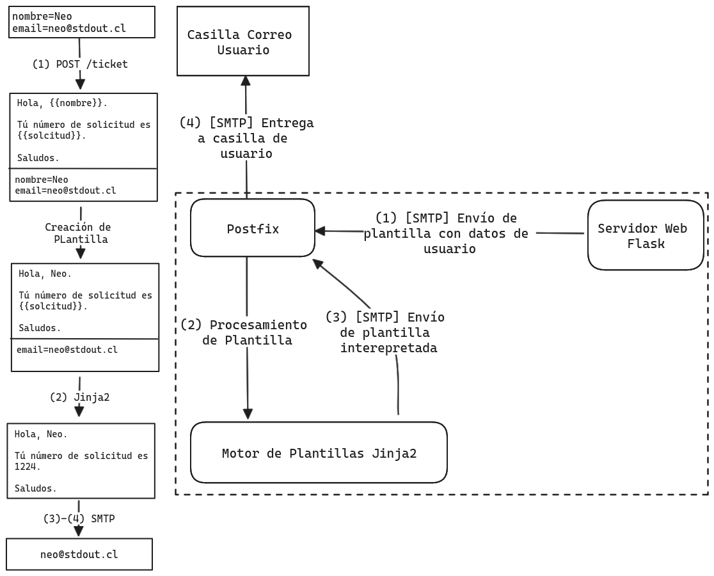

# Tickets-QA
Sistema de Tickets. NO ESTÁ LISTO PARA PRODUCCIÓN AÚN!!!!!!

## Contexto
Nos pidieron hacer este sistema de gestión de tickets en menos de dos días.
Perdimos el control y la infraestructura es un desastre y no supimos como
manejar los datos entre tantas partes. El sistema funciona así:

1. El usuario llena un formulario
2. Al enviarlo, se crea un template de Jinja2 de manera dinámica, el cual es
   enviado a través de SMTP a un servidor de correo interno. Este mensaje
   incluye un json con el template y la dirección de correo indicada por el
   usuario.
3. Cada vez que llega un correo al usuario solicitud@dominioreal.xyz desde webform@dominioreal.xyz este va a ser pasado a un script (process_email.py).
4. El script toma el template del json y lo renderiza con Jinja2, incluyendo el código de la solicitud.
5. El mensaje final es enviado por correo a la dirección incluida en el json. Esto se hace usando el mismo servidor postfix de antes como relay.

Amigos y amigas mías, si no entendieron lo último no se preocupen, es un
desastre. Les dejo un diagrama:

Nuestra empresa no tiene presupuesto para ciberseguridad, así que cualquier
ayuda es bienvenida.

El sitio actual se encuentra en http://dominioreal.xyz.

